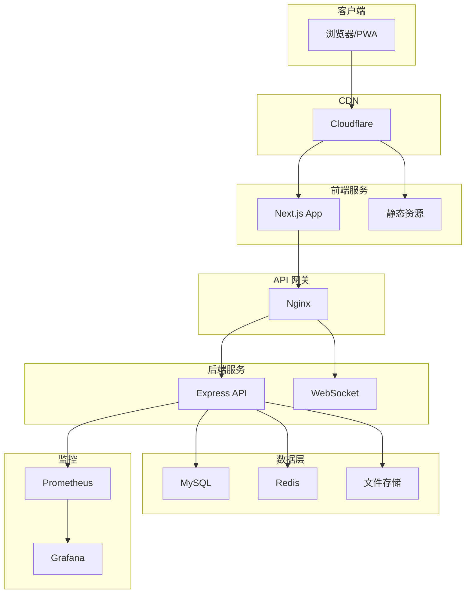
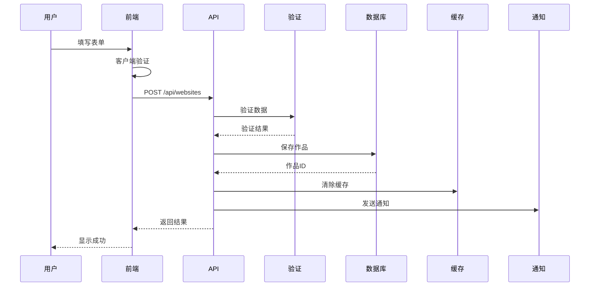
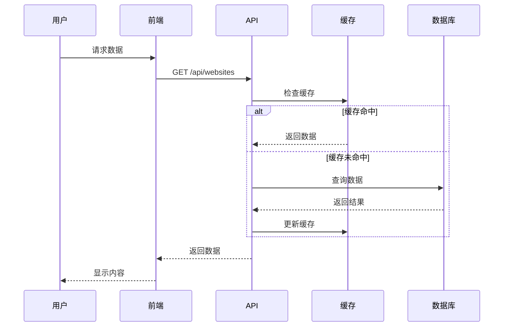

# WebSpark.club 架构设计文档

## 📋 目录

- [项目概述](#项目概述)
- [技术栈](#技术栈)
- [系统架构](#系统架构)
- [目录结构](#目录结构)
- [核心模块](#核心模块)
- [数据流](#数据流)
- [安全架构](#安全架构)
- [性能优化](#性能优化)
- [部署架构](#部署架构)
- [监控与运维](#监控与运维)

## 项目概述

WebSpark.club 是一个 Web 作品展示社区，采用前后端分离的架构设计，专为单人维护优化。

### 设计原则

1. **简单可维护**：采用单体架构，避免过度工程
2. **高性能**：全面的缓存策略和性能优化
3. **安全可靠**：多层安全防护和数据保护
4. **易于扩展**：模块化设计，便于功能扩展
5. **自动化运维**：完善的监控和自动化部署

## 技术栈

### 前端
- **框架**: Next.js 14 (App Router)
- **语言**: TypeScript
- **样式**: Tailwind CSS
- **状态管理**: React Context + SWR
- **认证**: NextAuth.js
- **表单**: React Hook Form + Zod
- **图表**: Chart.js, Recharts
- **动画**: Framer Motion
- **PWA**: next-pwa

### 后端
- **框架**: Express.js
- **语言**: TypeScript
- **数据库**: MySQL 8.0
- **ORM**: Prisma
- **缓存**: Redis (ioredis)
- **认证**: JWT
- **验证**: Joi
- **日志**: Winston
- **进程管理**: PM2

## 系统架构



## 目录结构

```
webspark/
├── frontend/                 # 前端应用
│   ├── src/
│   │   ├── app/             # Next.js App Router
│   │   │   ├── (auth)/      # 认证相关页面
│   │   │   ├── (main)/      # 主要页面
│   │   │   ├── admin/       # 管理后台
│   │   │   └── api/         # API 路由
│   │   ├── components/      # React 组件
│   │   │   ├── common/      # 通用组件
│   │   │   ├── layout/      # 布局组件
│   │   │   ├── features/    # 功能组件
│   │   │   └── admin/       # 管理组件
│   │   ├── hooks/           # 自定义 Hooks
│   │   ├── lib/             # 工具库
│   │   ├── styles/          # 全局样式
│   │   └── types/           # TypeScript 类型
│   └── public/              # 静态资源
│
├── backend/                 # 后端应用
│   ├── src/
│   │   ├── routes/          # API 路由
│   │   ├── services/        # 业务逻辑
│   │   ├── middleware/      # 中间件
│   │   ├── utils/           # 工具函数
│   │   ├── lib/             # 核心库
│   │   └── config/          # 配置
│   ├── prisma/              # 数据库配置
│   │   ├── schema.prisma    # 数据模型
│   │   └── migrations/      # 数据库迁移
│   └── scripts/             # 运维脚本
│
└── docs/                    # 文档
```

## 核心模块

### 1. 认证模块

```typescript
// 认证流程
┌─────────┐     ┌─────────┐     ┌─────────┐
│ Client  │────▶│NextAuth │────▶│ GitHub  │
└─────────┘     └─────────┘     └─────────┘
     │               │                 │
     │               ▼                 │
     │          ┌─────────┐           │
     └─────────▶│   JWT   │◀──────────┘
                └─────────┘
                     │
                     ▼
                ┌─────────┐
                │   API   │
                └─────────┘
```

- GitHub OAuth 认证
- JWT Token 管理
- 会话同步
- 权限控制

### 2. 数据模型

```prisma
// 核心数据模型
model User {
  id            Int       @id @default(autoincrement())
  email         String    @unique
  username      String    @unique
  role          Role      @default(USER)
  websites      Website[]
  comments      Comment[]
  likes         WebsiteLike[]
  bookmarks     Bookmark[]
  followers     Follow[]  @relation("followers")
  following     Follow[]  @relation("following")
}

model Website {
  id              Int       @id @default(autoincrement())
  title           String
  url             String
  slug            String    @unique
  status          Status    @default(PENDING)
  author          User      @relation(fields: [authorId])
  tags            Tag[]
  comments        Comment[]
  likes           WebsiteLike[]
  views           WebsiteView[]
}
```

### 3. API 设计

```typescript
// RESTful API 设计
GET    /api/websites          # 获取作品列表
POST   /api/websites          # 提交新作品
GET    /api/websites/:id      # 获取作品详情
PUT    /api/websites/:id      # 更新作品
DELETE /api/websites/:id      # 删除作品

// 统一响应格式
{
  success: boolean
  data?: any
  error?: {
    code: string
    message: string
    details?: any
  }
  meta?: {
    page: number
    limit: number
    total: number
  }
}
```

### 4. 缓存策略

```typescript
// 多级缓存架构
┌─────────┐     ┌─────────┐     ┌─────────┐
│ Browser │────▶│   CDN   │────▶│  Redis  │
└─────────┘     └─────────┘     └─────────┘
                                      │
                                      ▼
                                ┌─────────┐
                                │   DB    │
                                └─────────┘
```

- 浏览器缓存：静态资源
- CDN 缓存：图片、CSS、JS
- Redis 缓存：热点数据、会话
- 数据库查询缓存

### 5. 安全架构

```typescript
// 安全防护层
┌─────────────────────────────────┐
│          WAF (Cloudflare)       │
├─────────────────────────────────┤
│         Rate Limiting           │
├─────────────────────────────────┤
│          CSRF Token             │
├─────────────────────────────────┤
│        Input Validation         │
├─────────────────────────────────┤
│          SQL Injection          │
├─────────────────────────────────┤
│         XSS Protection          │
└─────────────────────────────────┘
```

## 数据流

### 1. 作品提交流程



### 2. 数据查询流程



## 性能优化

### 1. 前端优化

- **代码分割**: 动态导入，按需加载
- **图片优化**: Next.js Image 组件，WebP 格式
- **预加载**: 关键资源预加载
- **PWA**: 离线缓存，后台同步
- **虚拟滚动**: 大列表性能优化

### 2. 后端优化

- **查询优化**: 索引优化，避免 N+1
- **批处理**: 批量操作减少 IO
- **连接池**: 数据库连接复用
- **异步处理**: 非关键任务异步化
- **压缩**: Gzip/Brotli 压缩

### 3. 数据库优化

```sql
-- 关键索引
CREATE INDEX idx_websites_status_created ON websites(status, createdAt);
CREATE INDEX idx_websites_author_status ON websites(authorId, status);
CREATE INDEX idx_users_username ON users(username);
CREATE INDEX idx_tags_name ON tags(name);
```

## 部署架构

### 1. 生产环境

```yaml
# docker-compose.yml
version: '3.8'
services:
  frontend:
    image: webspark/frontend:latest
    ports:
      - "3000:3000"
    environment:
      - NODE_ENV=production
  
  backend:
    image: webspark/backend:latest
    ports:
      - "4000:4000"
    environment:
      - NODE_ENV=production
    depends_on:
      - mysql
      - redis
  
  mysql:
    image: mysql:8.0
    volumes:
      - mysql_data:/var/lib/mysql
  
  redis:
    image: redis:7-alpine
    volumes:
      - redis_data:/data
  
  nginx:
    image: nginx:alpine
    ports:
      - "80:80"
      - "443:443"
    volumes:
      - ./nginx.conf:/etc/nginx/nginx.conf
```

### 2. CI/CD 流程

```yaml
# .github/workflows/deploy.yml
name: Deploy

on:
  push:
    branches: [main]

jobs:
  deploy:
    runs-on: ubuntu-latest
    steps:
      - uses: actions/checkout@v3
      - name: Build
        run: |
          docker build -t webspark/frontend ./frontend
          docker build -t webspark/backend ./backend
      - name: Deploy
        run: |
          docker-compose up -d
```

## 监控与运维

### 1. 监控指标

- **系统指标**: CPU、内存、磁盘、网络
- **应用指标**: QPS、响应时间、错误率
- **业务指标**: 用户活跃度、内容增长
- **安全指标**: 异常登录、攻击检测

### 2. 告警规则

```typescript
// 告警配置
const alertRules = [
  {
    name: 'High Error Rate',
    metric: 'error_rate',
    threshold: 5,
    duration: 300,
    severity: 'critical'
  },
  {
    name: 'Slow Response',
    metric: 'response_time',
    threshold: 1000,
    duration: 300,
    severity: 'warning'
  }
];
```

### 3. 日志管理

```typescript
// 日志级别
- error: 错误日志
- warn: 警告日志
- info: 信息日志
- debug: 调试日志

// 日志格式
{
  timestamp: '2024-01-15T10:00:00Z',
  level: 'error',
  message: 'Database connection failed',
  context: {
    userId: 123,
    requestId: 'xxx-xxx-xxx',
    error: { ... }
  }
}
```

## 最佳实践

### 1. 开发规范

- 使用 TypeScript 严格模式
- 遵循 ESLint 规则
- 编写单元测试
- 代码审查
- 文档先行

### 2. 安全规范

- 最小权限原则
- 敏感数据加密
- 定期安全审计
- 依赖版本更新
- 安全头配置

### 3. 运维规范

- 自动化部署
- 蓝绿部署
- 数据备份
- 灾难恢复
- 性能监控

## 扩展性考虑

### 1. 水平扩展

- 无状态设计
- 负载均衡
- 读写分离
- 缓存集群

### 2. 功能扩展

- 插件系统
- Webhook
- API 版本控制
- 模块化架构

## 总结

WebSpark.club 采用现代化的技术栈和架构设计，在保证系统简单可维护的同时，提供了高性能、高安全性和良好的扩展性。整个系统专为单人维护优化，通过自动化和监控减少运维负担。
